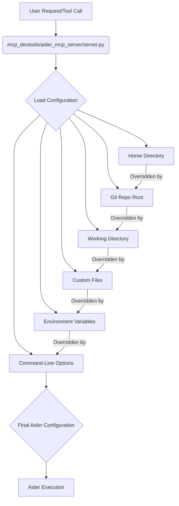

# Aider Configuration in MCP-DevTools

This document explains how Aider, when used within the MCP-DevTools environment, reads and applies its configuration settings. Understanding this hierarchy is crucial for effectively managing Aider's behavior.

## Configuration Sources and Precedence

Aider's configuration is loaded from a hierarchical set of sources, with later items overriding earlier ones. This allows for flexible and granular control over Aider's behavior.

The `mcp_devtools/aider_mcp_server/server.py` module is responsible for orchestrating this configuration loading process.

Here's the order of precedence for configuration sources, from lowest to highest:

1.  **Home Directory Configuration**:
    *   **Files**: `~/.aider.conf.yml` and `~/.env`
    *   **Purpose**: These files provide global default settings for Aider and environment variables that apply across all projects.

2.  **Git Repository Root Configuration**:
    *   **Files**: `.aider.conf.yml` and `.env`
    *   **Purpose**: If the current working directory (or the `repo_path` provided to the MCP server) is part of a Git repository, Aider will look for configuration and environment files in the root of that repository. These settings will override any conflicting settings found in the home directory.

3.  **Working Directory Configuration**:
    *   **Files**: `.aider.conf.yml` and `.env`
    *   **Purpose**: The directory where the Aider command is executed (or the `repo_path` specified to the MCP server) is the primary location for local, project-specific configuration and environment variables. Settings defined here take precedence over those found in the Git root or home directory.

4.  **Custom Configuration/Environment Files (Explicitly Provided)**:
    *   **Mechanism**: The `mcp_devtools/aider_mcp_server/server.py`'s `server_lifespan` function can accept `config_file` and `env_file` parameters during the server's initialization.
    *   **Purpose**: If provided, these custom files will be loaded, and their settings will take the highest precedence among file-based configurations. This allows for specific configurations to be applied without modifying existing project files.

5.  **Environment Variables (Set by MCP or System)**:
    *   **Mechanism**: Environment variables can be set directly in the system or through the `claude_desktop_config.json` file (managed by `mcp/cli/claude.py`). The `mcp_devtools/aider_mcp_server/server.py` module explicitly sets environment variables from loaded `.env` files and `aider_config` (e.g., `OPENAI_API_BASE`) into the process environment.
    *   **Purpose**: These environment variables can override values sourced from `.aider.conf.yml` or `.env` files. For example, `OPENAI_API_KEY`, `ANTHROPIC_API_KEY`, and `AIDER_MODEL` are commonly set via environment variables.

6.  **Command-Line Options**:
    *   **Mechanism**: When tools like `edit_files` are invoked, additional options can be passed directly as command-line arguments to the `aider` executable.
    *   **Purpose**: These options provide the most immediate and highest-precedence way to configure Aider's behavior for a specific operation, overriding all other configuration sources.

## Configuration Loading Process Flow

The `load_aider_config` and `load_dotenv_file` functions in `mcp_devtools/aider_mcp_server/server.py` implement this hierarchy. They collect potential configuration paths (working directory, Git root, custom, home directory) and then load them in reverse order of precedence. This ensures that settings from higher-priority locations (e.g., working directory) overwrite those from lower-priority locations (e.g., home directory).

By understanding this configuration hierarchy, users can effectively manage Aider's behavior within the MCP-DevTools environment, ensuring that the desired settings are applied for their specific development tasks.